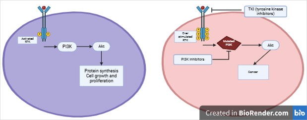

**Kinases – Key Enzymes Influencing Precision Oncology**

Authors (@slack): Vidhyavathy Nagarajan (@Vidhya2205)

**Introduction**

Kinases are enzymes that add phosphate groups to biomolecules and can be broadly classified based on their targets\[1].  Two such groups of kinases that play a significant role in the development of cancer are protein kinases(PKs) and lipid kinases (LKs)\[2,3,4]. The PKs are further divided based on the target residue they phosphorylate (Tyrosine kinase, serine threonine kinase and atypical kinases)\[3]. These kinases are involved in a wide range of functions including proliferation, cell cycle, apoptosis, motility, growth, differentiation\[2,4]. Hence, disruption in kinase activity is a crucial driving factor in cancer and serves as an important biomarker for cancer subtype classification and therapy prediction.

**Kinases as predictive biomarkers in cancer precision medicine**

Multiple kinases have been established as key biomarkers in cancer classification, targeted therapy and prognosis, some of which include ERBB2 (HER2), EGFR, MET, ALK, AKT2 \[2,5]. RTKs are of key importance in the field of precision oncology since patients with overexpression/ amplifications or mutations of these are administered with targeted therapies and show improved overall outcome compared to conventional therapies such as chemotherapy\[18-20]. Often, these kinases act together to promote their functions. Consequently, disruptions in the downstream kinase activity renders the upstream targeted therapies ineffective and hence serve as a biomarker. One such example is, in receptor tyrosine kinase(EGFR and ERBB2) activated cancer PI3K(another kinase) pathway activation results in reduced efficacy of TKI (tyrosine kinase inhibitors)\[6-10].

<!--[endif]-->
Figure <!--[if supportFields]> SEQ
Figure \* ARABIC <![endif]-->1<!--[if supportFields]><![endif]-->. RTK and PI3K association in cancer

**_PIK3CA_ mutations as a biomarker of TKI Response**

_PIK3CA_ gene encodes for a catalytic subunit of the PI3K protein, a significant LK involved in signaling pathways that drive cancer growth \[10].  Figure1 illustrates that PI3K lies downstream of RTKs and is activated by the same.  TKI’s are widely used in multiple cancers with over stimulated RTKs. Despite the success of TKIs, therapy resistance or relapse is observed in some cases. The presence of _PIK3CA_ activating mutations that stimulate the PI3K-AKT pathway are commonly observed in these cases\[6-13].&#x20;

In case of non-small cell lung cancer, _EGFR_ is a frequently mutated gene and several targeted therapies have been administered in such cases\[11]. However, several studies have reported that _PIK3CA _mutations are associated with poor overall survival when treated with anti-EGFR (TKI). Further, it is also shown that these result in therapy resistance and cancer relapse\[6,10-13]. Similarly in breast cancer as well, HER2 is a prominent biomarker and targeted therapies have been approved for HER2-positive(_ERBB2_ disruptions) cancers. Nevertheless, studies established the negative correlation between _PIK3CA_ mutations and the prognosis of anti-HER2 therapy\[7-10].

**Conclusion**

Kinases are significant biomarkers in the field of cancer precision medicine providing new therapeutic targets and prognostic insights\[14-16]. Although, these lead to the development of TKI, it is evident for the need of more biomarkers such as _PIK3CA _mutations or other downstream kinases that predict the response to these TKIs and avoid adverse effects\[6-13, 17].

**References**

<!--[if !supportLists]-->1.      <!--[endif]-->Cheek S, Zhang H, Grishin NV. Sequence and structure classification of kinases. J Mol Biol. 2002 Jul 19;320(4):855-81. doi: 10.1016/s0022-2836(02)00538-7. PMID: 12095261. <!--[endif]-->

<!--[if !supportLists]-->2.      <!--[endif]-->Cicenas J, Zalyte E, Bairoch A, Gaudet P. Kinases and Cancer. Cancers (Basel). 2018 Mar 1;10(3):63. doi: 10.3390/cancers10030063. PMID: 29494549; PMCID: PMC5876638.

<!--[if !supportLists]-->3.      <!--[endif]-->Gotink KJ, Verheul HM. Anti-angiogenic tyrosine kinase inhibitors: what is their mechanism of action? Angiogenesis. 2010 Mar;13(1):1-14. doi: 10.1007/s10456-009-9160-6. Epub 2009 Dec 11. PMID: 20012482; PMCID: PMC2845892.

<!--[if !supportLists]-->4.      <!--[endif]-->Gross S, Rahal R, Stransky N, Lengauer C, Hoeflich KP. Targeting cancer with kinase inhibitors. J Clin Invest. 2015 May;125(5):1780-9. doi: 10.1172/JCI76094. Epub 2015 May 1. PMID: 25932675; PMCID: PMC4463189.

<!--[if !supportLists]-->5.      <!--[endif]-->Zhou, Y., Tao, L., Qiu, J. _et al._ Tumor biomarkers for diagnosis, prognosis and targeted therapy. _Sig Transduct Target Ther_ **9**, 132 (2024). <https://doi.org/10.1038/s41392-024-01823-2>

<!--[if !supportLists]-->6.      <!--[endif]-->Liu X, Mei W, Zhang P, Zeng C. PIK3CA mutation as an acquired resistance driver to EGFR-TKIs in non-small cell lung cancer: Clinical challenges and opportunities. Pharmacol Res. 2024 Apr;202:107123. doi: 10.1016/j.phrs.2024.107123. Epub 2024 Mar 2. PMID: 38432445.

<!--[if !supportLists]-->7.      <!--[endif]-->Rasti AR, Guimaraes-Young A, Datko F, Borges VF, Aisner DL, Shagisultanova E. _PIK3CA_ Mutations Drive Therapeutic Resistance in Human Epidermal Growth Factor Receptor 2-Positive Breast Cancer. JCO Precis Oncol. 2022 Mar;6:e2100370. doi: 10.1200/PO.21.00370. PMID: 35357905; PMCID: PMC8984255.

<!--[if !supportLists]-->8.      <!--[endif]-->Shi, Q., Xuhong, J., Luo, T. _et al._ PIK3CA mutations are associated with pathologic complete response rate to neoadjuvant pyrotinib and trastuzumab plus chemotherapy for HER2-positive breast cancer. _Br J Cancer_ **128**, 121–129 (2023). <https://doi.org/10.1038/s41416-022-02021-z>

<!--[if !supportLists]-->9.      <!--[endif]-->Black, J., Lopez, S., Cocco, E. _et al._ PIK3CA oncogenic mutations represent a major mechanism of resistance to trastuzumab in HER2/neu overexpressing uterine serous carcinomas. _Br J Cancer_ **113**, 1020–1026 (2015). <https://doi.org/10.1038/bjc.2015.306>

<!--[if !supportLists]-->10. <!--[endif]-->Alqahtani A, Ayesh HSK, Halawani H. PIK3CA Gene Mutations in Solid Malignancies: Association with Clinicopathological Parameters and Prognosis. Cancers (Basel). 2019 Dec 30;12(1):93. doi: 10.3390/cancers12010093. PMID: 31905960; PMCID: PMC7017171.

<!--[if !supportLists]-->11. <!--[endif]-->Araki T, Kanda S, Horinouchi H, Ohe Y. Current treatment strategies for EGFR-mutated non-small cell lung cancer: from first line to beyond osimertinib resistance. Jpn J Clin Oncol. 2023 Jun 29;53(7):547-561. doi: 10.1093/jjco/hyad052. PMID: 37279591; PMCID: PMC10311169.

<!--[if !supportLists]-->12. <!--[endif]-->Qiu X, Wang Y, Liu F, Peng L, Fang C, Qian X, Zhang X, Wang Q, Xiao Z, Chen R, Yuan S, Li Y. Survival and prognosis analyses of concurrent PIK3CA mutations in EGFR mutant non-small cell lung cancer treated with EGFR tyrosine kinase inhibitors. Am J Cancer Res. 2021 Jun 15;11(6):3189-3200. PMID: 34249454; PMCID: PMC8263631.

<!--[if !supportLists]-->13. <!--[endif]-->Ludovini V, Bianconi F, Pistola L, Chiari R, Minotti V, Colella R, Giuffrida D, Tofanetti FR, Siggillino A, Flacco A, Baldelli E, Iacono D, Mameli MG, Cavaliere A, Crinò L. Phosphoinositide-3-kinase catalytic alpha and KRAS mutations are important predictors of resistance to therapy with epidermal growth factor receptor tyrosine kinase inhibitors in patients with advanced non-small cell lung cancer. J Thorac Oncol. 2011 Apr;6(4):707-15. doi: 10.1097/JTO.0b013e31820a3a6b. PMID: 21258250.

<!--[if !supportLists]-->14. <!--[endif]-->Tomuleasa, C., Tigu, AB., Munteanu, R. _et al._ Therapeutic advances of targeting receptor tyrosine kinases in cancer. _Sig Transduct Target Ther_ **9**, 201 (2024). <https://doi.org/10.1038/s41392-024-01899-w>

<!--[if !supportLists]-->15. <!--[endif]-->Das S, Dey MK, Devireddy R, Gartia MR. Biomarkers in Cancer Detection, Diagnosis, and Prognosis. Sensors (Basel). 2023 Dec 20;24(1):37. doi: 10.3390/s24010037. PMID: 38202898; PMCID: PMC10780704.

<!--[if !supportLists]-->16. <!--[endif]-->Quan C, Xiao J, Liu L, Duan Q, Yuan P, Zhu F. Protein Kinases as Tumor Biomarkers and Therapeutic Targets. Curr Pharm Des. 2017 Nov 16;23(29):4209-4225. doi: 10.2174/1381612823666170720113216. PMID: 28730960.

<!--[if !supportLists]-->17. <!--[endif]-->Shyam Sunder, S., Sharma, U.C. & Pokharel, S. Adverse effects of tyrosine kinase inhibitors in cancer therapy: pathophysiology, mechanisms and clinical management. _Sig Transduct Target Ther_ **8**, 262 (2023). <https://doi.org/10.1038/s41392-023-01469-6>

<!--[if !supportLists]-->18. <!--[endif]-->Regad T. Targeting RTK Signaling Pathways in Cancer. Cancers (Basel). 2015 Sep 3;7(3):1758-84. doi: 10.3390/cancers7030860. PMID: 26404379; PMCID: PMC4586793.

<!--[if !supportLists]-->19. <!--[endif]-->Zhang N, Li Y. Receptor tyrosine kinases: biological functions and anticancer targeted therapy. MedComm (2020). 2023 Dec 7;4(6):e446. doi: 10.1002/mco2.446. PMID: 38077251; PMCID: PMC10701465.

<!--[if !supportLists]-->20. <!--[endif]-->Tomuleasa, C., Tigu, AB., Munteanu, R. _et al._ Therapeutic advances of targeting receptor tyrosine kinases in cancer. _Sig Transduct Target Ther_ **9**, 201 (2024). https\://doi.org/10.1038/s41392-024-01899-w
